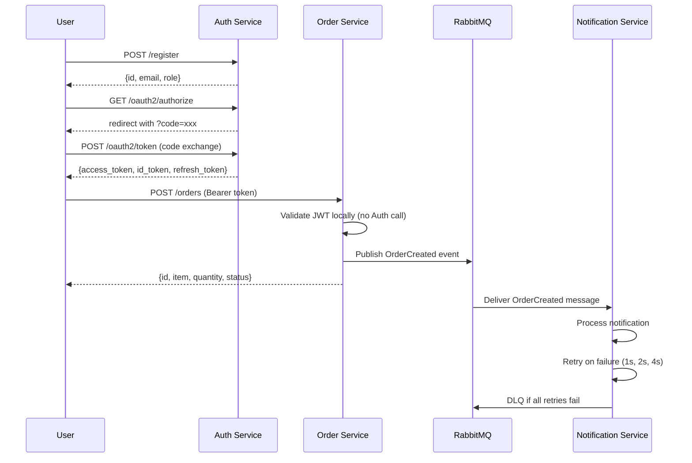

# microservices-demo — Microservices with OAuth2/OIDC + Event-Driven Architecture

Three Python/FastAPI microservices demonstrating OAuth2/OIDC authentication, JWT-based authorization, role-based access control, and event-driven communication via RabbitMQ — all running via Docker Compose and deployed to AWS EC2.

**Live (AWS EC2):**
- Auth Service: `http://47.129.120.73:8001/docs`
- Order Service: `http://47.129.120.73:8002/docs`

---

## Architecture



---

## Services

### Auth Service (port 8001)
Handles user registration, login, and implements the full OAuth2 Authorization Code flow with OIDC.

| Endpoint | Method | Description |
|---|---|---|
| `/register` | POST | Register a new user (BCrypt password hashing) |
| `/login` | POST | Login and receive a JWT access token |
| `/oauth2/authorize` | GET | OAuth2 Authorization Code flow — issues short-lived code |
| `/oauth2/token` | POST | Exchange code for access + id + refresh tokens |
| `/userinfo` | GET | Returns OIDC identity claims from access token |
| `/admin-only` | GET | RBAC demo — requires ADMIN role |

### Order Service (port 8002)
CRUD API for orders. Validates JWTs **locally** using the shared secret — no network call to Auth Service needed.

| Endpoint | Method | Description |
|---|---|---|
| `/orders` | POST | Create an order (requires JWT) |
| `/orders` | GET | List current user's orders (requires JWT) |
| `/orders/{id}` | GET | Get a specific order (requires JWT) |
| `/orders/{id}` | DELETE | Delete an order (requires JWT) |

### Notification Service (no HTTP port)
A pure RabbitMQ consumer. Listens on the `notifications` queue for `OrderCreated` events, processes them with retry logic and a Dead Letter Queue for failures.

---

## Key Technical Decisions

### Why JWT validated locally in Order Service?
Validating tokens locally (using the shared `SECRET_KEY`) avoids a network call to Auth Service on every request — making Order Service faster and not dependent on Auth Service's availability at request time. The cryptographic signature guarantees the token's integrity without needing to ask the issuer.

### Why OAuth2 Authorization Code flow instead of just returning the token directly?
The Authorization Code flow keeps the actual token off the browser URL (which is visible in history, referrer headers, and server logs). The short-lived, single-use code that travels through the browser is useless to anyone who intercepts it — the real token exchange happens server-to-server.

### Why RabbitMQ instead of direct HTTP call from Order to Notification?
A direct call would tightly couple the two services — if Notification Service is slow or down, Order creation would block or fail. RabbitMQ decouples them completely: Order Service publishes and immediately returns; Notification Service processes at its own pace. Messages are never lost even if Notification Service temporarily goes down.

### Why exponential backoff (1s, 2s, 4s) for retries?
Immediate retries on failure often hit the same transient issue (e.g. a briefly unavailable external API). Waiting progressively longer gives the downstream service time to recover, and prevents thundering herd — all services retrying simultaneously under load.

---

## Tech Stack

| Layer | Technology |
|---|---|
| Services | FastAPI (Python) |
| Database | PostgreSQL 16 (separate instance per service) |
| Auth | JWT (python-jose) + BCrypt |
| OAuth2/OIDC | Custom implementation (authorize, token, userinfo endpoints) |
| Messaging | RabbitMQ 3 with management UI |
| Containerization | Docker + Docker Compose |
| CI | GitHub Actions (matrix build — parallel per service) |
| Deployment | AWS EC2 |

---

## Local Setup

```bash
git clone https://github.com/shaznamuees1-dev/microservices-demo.git
cd microservices-demo
docker-compose up --build
```

Services available at:
- Auth Service: `http://localhost:8001/docs`
- Order Service: `http://localhost:8002/docs`
- RabbitMQ UI: `http://localhost:15672` (guest/guest)

### Test the full flow
```bash
# Register
curl -X POST http://localhost:8001/register \
  -H "Content-Type: application/json" \
  -d '{"email":"test@test.com","password":"password123"}'

# Login
curl -X POST http://localhost:8001/login \
  -H "Content-Type: application/json" \
  -d '{"email":"test@test.com","password":"password123"}'

# Create order (use token from login response)
curl -X POST http://localhost:8002/orders \
  -H "Authorization: Bearer YOUR_TOKEN" \
  -H "Content-Type: application/json" \
  -d '{"item":"laptop","quantity":1}'
```

---

## What I Learned

- Implementing OAuth2 Authorization Code flow from scratch — understanding exactly why each step (code → exchange → token) exists, rather than just using a library abstractly
- How OIDC extends OAuth2 by adding an `id_token` alongside the `access_token` to carry user identity claims
- Why JWTs can be verified locally without contacting the issuer — the cryptographic signature is self-contained
- RabbitMQ's exchange/queue/binding model and how `topic` exchanges enable flexible routing
- Why exponential backoff matters for retries — prevents thundering herd under load
- Running 6 Docker containers on a `t3.micro` (1GB RAM) requires careful resource management — disk cleanup and stopping unused containers was necessary before deployment

---

## Author

**Shazna Muees**
Software Engineer
[GitHub](https://github.com/shaznamuees1-dev) · [LinkedIn](https://www.linkedin.com/in/shaznamuees/)
